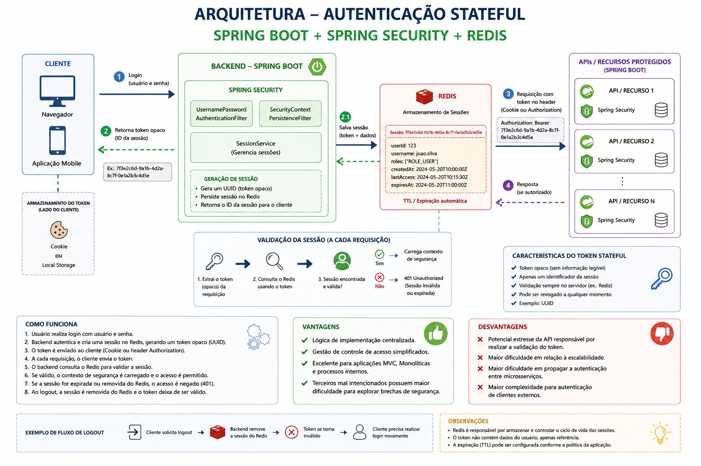

# Stateful Authentication Project

 
Autenticação Stateful é comumente usada em aplicações, especialmente as que NÃO exigem muita escalabilidade.

- A sessão com estado é criada no lado do servidor backend e o ID de referência da sessão correspondente é enviado ao cliente.
- Usa um token opaco, ou seja, tokens em um formato proprietário, em que não é possível acessar informações do usuário e contém algum identificador para acessar informações persistidas em algum servidor de armazenamento.
- Para validar o token é preciso enviar uma requisição, normalmente HTTP, contendo o token para o servidor que o gerou.
- Token opaco é normalmente uma string simples que não possui significado legível.
- Como token opaco, por exemplo, podemos usar UUIDs para representar a sessão do usuário.
- A base de dados para armazenamento mais comumente usada é o Redis.
Desta forma, uma vez que o ID de referência é excluído no lado do servidor o cleinte nao conseguirá mais se autenticar, sendo necessário gerar um novo.

## Vantagens

- Lógica de implementação centralizada.
- Gestão de controle de acesso simplificados.
- Excelente para aplicações MVC, Monolíticas e processos internos.
- Maior complexidade para autenticação de clientes externos.
- Terceiros mal intencionados possuem maior dificuldade para explorar brechas de segurança.

## Desvantagens

- Potencial estresse da API responsável por realizar a validação do token.
- Maior dificuldade em relação a escalabilidade
- Maior dificuldade em propagar a autenticação entre microsserviços.

## Arquitetura

## Tecnologias

- Linguagem: Java
- Frameworks: Spring Boot, Spring Security
- Dados: PostgreSQL, Redis, Validation
- Ferramentas/ORMs: JPA/Hibernate, Lombok
- Infraestrutura: Docker, Docker compose, Jenkins
- Documentação: Swagger/OpenAPI, Postman

## Como executar o projeto

Há dois caminhos para executar o projeto

### Executando o projeto com Docker

- Execute o comando para empacotar a aplicação: mvn clean package
- Execute o comando para gerar o build da imagem Docker: docker build -t stateful-auth-api
- Execute o comando para gerar o build da imagem Docker: docker build -t stateful-any-api
- Execute o docker compose na raiz dos projetos para executar toda a apicação: docker compose up

### Build Execução do projeto com Jenkins

- Adicione a cada projeto o git
- Com cada projeto comitado, adicione a pipeline jenkins cada um dos projetos
- Execute a pipeline
- Esecute o comando: docker compose up